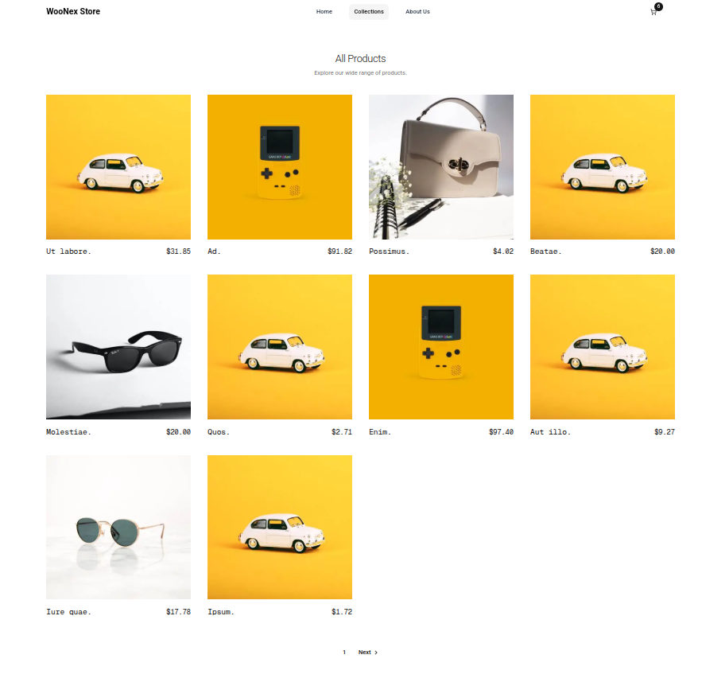
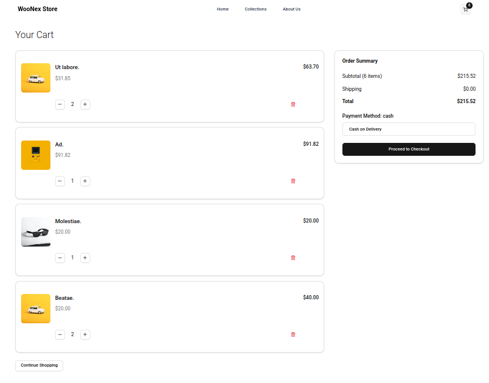
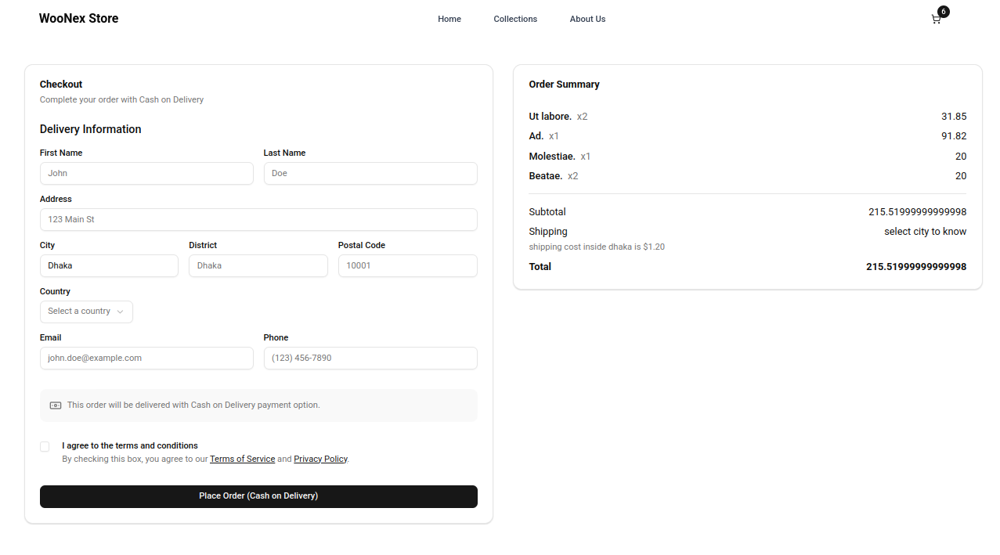

# Woo-Next-Store


[](https://nextjs.org/)
[](https://www.typescriptlang.org/)
[](https://tailwindcss.com/)
[](https://woocommerce.com/)
[](https://vercel.com/)

**Woo-Next-Store** is a modern e-commerce storefront built with **Next.js 14** and **TypeScript**, integrated with the **WooCommerce REST API**. It provides a responsive, user-friendly shopping experience with product browsing, cart management, and cash-on-delivery (COD) checkout. Styled with **Tailwind CSS** and enhanced with **shadcn/ui** components, the app is deployed on **Vercel** for scalability.

---

## Screenshots

| **Product Grid** | **Cart** | **Checkout** |
|------------------|----------|--------------|
|  |  |  |

---

## Features

- **Product Browsing**: Responsive product grid with pagination, fetching data from WooCommerce.
- **Cart Management**: Add, update, or remove items, persisted in localStorage via `CartProvider`.
- **Checkout**: Form-validated COD checkout using Zod for robust validation.
- **Pagination**: Navigate product pages with shadcn/ui Pagination component.
- **Responsive Design**: Mobile-first UI with Tailwind CSS.
- **SEO Optimization**: Server-side rendering and dynamic metadata for product pages.
- **WooCommerce API**: Secure product fetching and order creation via REST API.
- **Vercel Deployment**: Hosted with environment variable management for production.

## Tech Stack

- **Framework**: Next.js 14 (App Router)
- **Language**: TypeScript 5
- **Styling**: Tailwind CSS 4
- **UI Components**: shadcn/ui (Pagination, Button, etc.)
- **API Client**: `@woocommerce/woocommerce-rest-api`
- **Form Validation**: Zod
- **State Management**: React Context (`CartProvider`)
- **Persistence**: localStorage for cart data
- **Icons**: Lucide React
- **Deployment**: Vercel

## Prerequisites

- Node.js 18+ and npm/yarn
- WooCommerce store (e.g., `https://axessories.store`)
- WooCommerce REST API keys with Read/Write permissions
- Vercel account for deployment

## Getting Started

### 1. Clone the Repository

```bash
git clone https://github.com/sakib-diu/woo-next-store.git
cd woo-next-store
```

### 2. Install Dependencies

```bash
npm install
```

### 3. Configure Environment Variables

Create a `.env.local` file in the root directory:

```env
NEXT_PUBLIC_WOOCOMMERCE_URL=https://axessories.store
WOOCOMMERCE_CONSUMER_KEY=ck_your_consumer_key
WOOCOMMERCE_CONSUMER_SECRET=cs_your_consumer_secret
NEXT_PUBLIC_BASE_URL=http://localhost:3000
```

- Replace `ck_your_consumer_key` and `cs_your_consumer_secret` with your WooCommerce API keys.
- Update `NEXT_PUBLIC_WOOCOMMERCE_URL` to your store’s URL.
- Set `NEXT_PUBLIC_BASE_URL` to your Vercel deployment URL (e.g., `https://woo-next-store.vercel.app`) in production.

**Generate API Keys**:
1. Log in to your WordPress admin (`https://axessories.store/wp-admin`).
2. Go to **WooCommerce > Settings > Advanced > REST API**.
3. Click **Add Key**, select **Read/Write** permissions, and save.

### 4. Run Locally

```bash
npm run dev
```

Visit `http://localhost:3000`. The `/products` page should display products fetched from your WooCommerce store.

### 5. Build for Production

```bash
npm run build
npm run start
```

## Deployment

The app is deployed on **Vercel** for seamless hosting and scaling.

### Deploy to Vercel

1. **Install Vercel CLI**:

   ```bash
   npm install -g vercel
   ```

2. **Log in to Vercel**:

   ```bash
   vercel login
   ```

3. **Deploy**:

   ```bash
   vercel
   ```

4. **Set Environment Variables**:
   - In Vercel Dashboard: **Project > Settings > Environment Variables**.
   - Add:
     - `NEXT_PUBLIC_WOOCOMMERCE_URL=https://axessories.store`
     - `WOOCOMMERCE_CONSUMER_KEY=ck_your_key`
     - `WOOCOMMERCE_CONSUMER_SECRET=cs_your_secret`
     - `NEXT_PUBLIC_BASE_URL=https://woo-next-store.vercel.app`
   - Redeploy:
     ```bash
     vercel --prod
     ```

5. **Verify Deployment**:
   - Visit your Vercel URL (e.g., `https://woo-next-store.vercel.app/products`).
   - Check **Functions** > `/api/woocommerce/products` logs for errors.

## Adding Visuals

To customize the logo and screenshots:

1. **Logo**:
   - Design a logo for "Woo-Next-Store" (e.g., modern font with a shopping cart icon, 300x100px, PNG).
   - Tools:
     - **Canva**: Free e-commerce logo templates.
     - **Figma**: Custom design with Tailwind’s teal (`#38B2AC`).
     - **Hatchful by Shopify**: Free logo generator.
   - Save as `public/logo.png`.
   - Update README if using a different path:
     ```markdown
     
     ```

2. **Screenshots**:
   - Capture from your deployed site (`https://woo-next-store.vercel.app`):
     - **Product Grid**: `/products` page (1280x720px).
     - **Cart**: Cart modal or page (if implemented).
     - **Checkout**: Checkout form with COD (if implemented).
   - Crop to 800x600px using Preview (Mac) or Paint (Windows).
   - Save in `screenshots/` folder:
     - `screenshots/products-grid.png`
     - `screenshots/cart.png`
     - `screenshots/checkout.png`
   - Create the folder:
     ```bash
     mkdir screenshots
     ```
   - If cart/checkout aren’t built, use placeholders:
     ```markdown
     
     ```

3. **Commit Assets**:

   ```bash
   git add public/logo.png screenshots/*.png
   git commit -m "Add logo and screenshots for README"
   git push
   ```

4. **External Hosting (Optional)**:
   - Upload images to Cloudinary or GitHub.
   - Update README with GitHub raw URLs:
     ```markdown
     
     ```

## Project Structure

```
woo-next-store/
├── actions/
│   └── products-actions.ts        # Logic for fetching products
├── app/
│   ├── api/
│   │   └── woocommerce/[...path]/ # WooCommerce API proxy route
│   ├── products/
│   │   └── page.tsx              # Products page with pagination
│   └── layout.tsx                # Root layout with CartProvider
├── components/
│   ├── ProductsGrid.tsx          # Product grid with pagination
│   ├── CartProvider.tsx          # Cart context and localStorage
│   └── ui/                      # shadcn/ui components (e.g., Pagination)
├── lib/
│   └── utils.ts                 # Utility functions (e.g., cn for Tailwind)
├── types/
│   └── woocommerce.ts           # TypeScript types for WooCommerce
├── public/
│   └── logo.png                 # Store logo
├── screenshots/
│   ├── products-grid.png        # Product grid screenshot
│   ├── cart.png                 # Cart screenshot
│   ├── checkout.png             # Checkout screenshot
├── .env.local                   # Environment variables
├── next.config.js               # Next.js configuration
├── tsconfig.json                # TypeScript configuration
└── package.json                 # Dependencies and scripts
```

## Key Components

- **ProductsGrid**: Responsive grid displaying products with shadcn/ui Pagination.
- **ProductCard**: Individual product cards with add-to-cart functionality.
- **CartProvider**: Manages cart state, persisted in localStorage.
- **getProducts**: Fetches paginated products with error handling and logging.
- **createCODOrder**: Creates COD orders via WooCommerce API with Zod-validated forms.

## API Integration

The app uses the WooCommerce REST API (`@woocommerce/woocommerce-rest-api`) to:
- Fetch products (`/wp-json/wc/v3/products`).
- Create orders (`/wp-json/wc/v3/orders`).
- Support pagination with `per_page` and `page` parameters, extracting `X-WP-Total` and `X-WP-TotalPages` headers.

API requests are proxied through `/api/woocommerce/[...path]` to secure sensitive credentials.

## Troubleshooting

### Products Not Fetching
- **Check Logs**: In Vercel, go to **Functions** > `/api/woocommerce/products`:
  - Look for missing environment variables (e.g., `wooUrl: '[missing]'`).
  - Check for API errors (e.g., `401 Unauthorized`, `Invalid API Key`).
- **Verify Environment Variables**: Ensure `NEXT_PUBLIC_WOOCOMMERCE_URL`, `WOOCOMMERCE_CONSUMER_KEY`, `WOOCOMMERCE_CONSUMER_SECRET`, and `NEXT_PUBLIC_BASE_URL` are set in Vercel Dashboard > **Settings** > **Environment Variables**.
- **Test API Directly**:
  ```bash
  curl -X GET "https://axessories.store/wp-json/wc/v3/products?consumer_key=ck_your_key&consumer_secret=cs_your_secret"
  ```
- **Redeploy**:
  ```bash
  vercel --prod
  ```

### Pagination Issues
- Verify `X-WP-Total` and `X-WP-TotalPages` headers in API responses.
- Check `getProducts` logs for `totalPages` and `productCount` values.

### Cart or Checkout Issues
- Ensure `CartProvider` wraps the app in `app/layout.tsx`.
- Verify localStorage (`cartItems`) in DevTools > Application > Storage.
- Check Zod validation in checkout form for errors.

## Contributing

1. Fork the repository: [sakib-diu/woo-next-store](https://github.com/sakib-diu/woo-next-store).
2. Create a feature branch (`git checkout -b feature/your-feature`).
3. Commit changes (`git commit -m "Add your feature"`).
4. Push to the branch (`git push origin feature/your-feature`).
5. Open a Pull Request.

## License

This project is licensed under the MIT License.

## Contact

For issues or feature requests, open a GitHub issue on [sakib-diu/woo-next-store](https://github.com/sakib-diu/woo-next-store) or contact **sakibullah.official.com**.

---

Built with 🚀 by Sakib